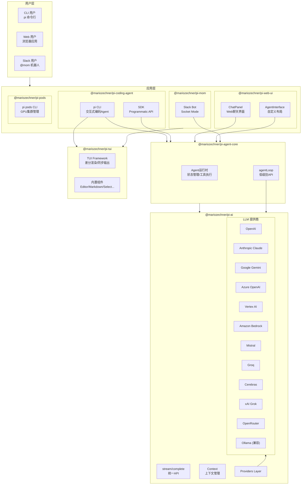
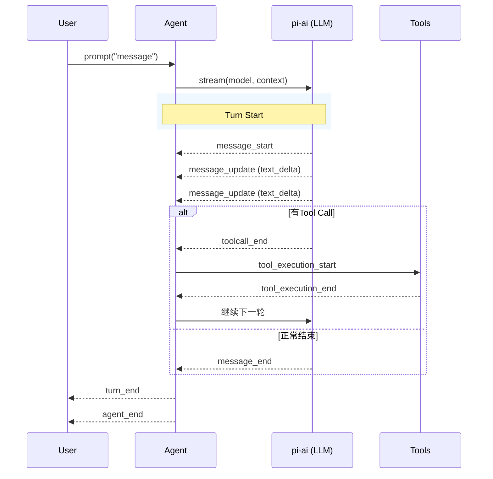
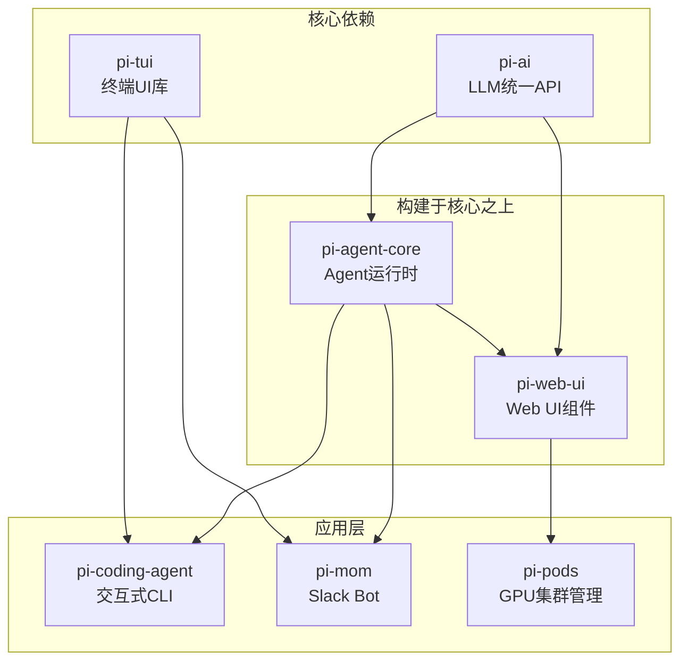
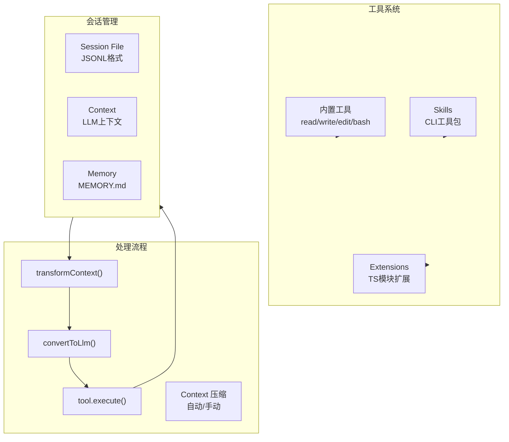
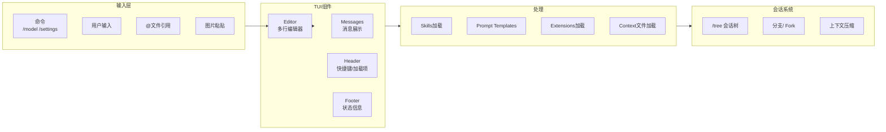
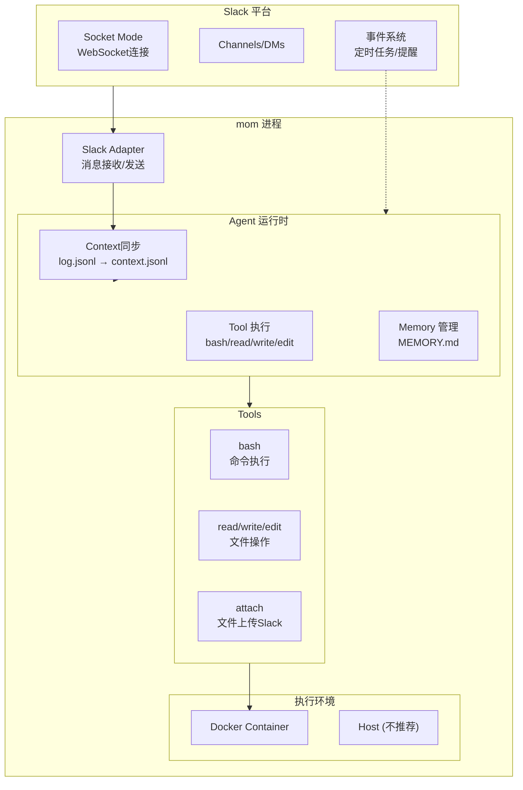
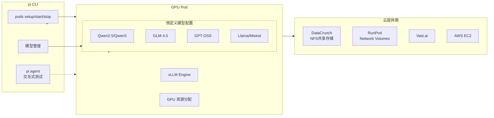
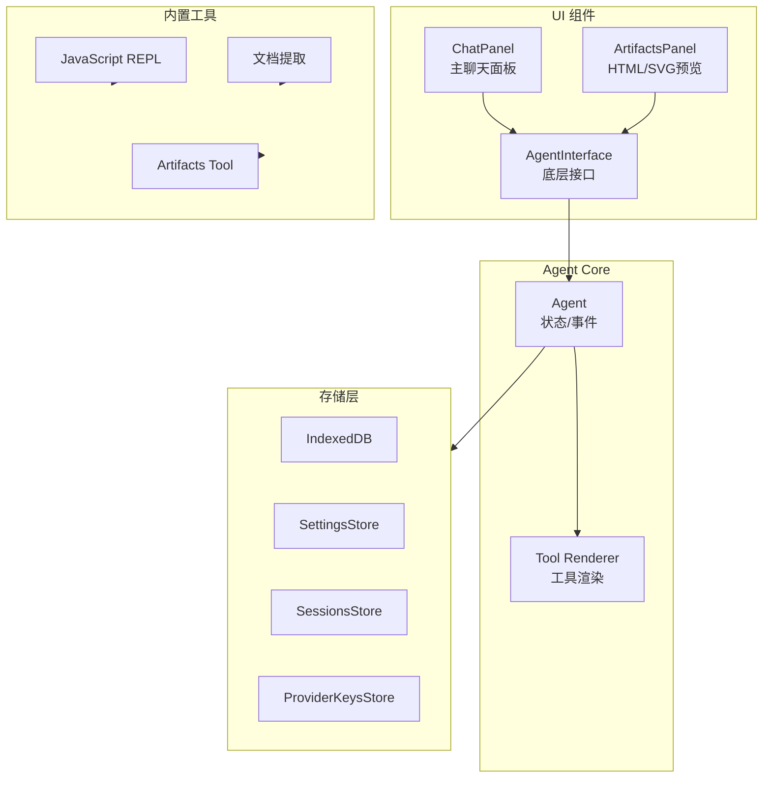

# Pi Monorepo 系统架构图

## 1. 整体系统架构

## 2. pi-ai 内部架构

```mermaid
flowchart LR
    subgraph Input["输入"]
        Model["getModel()<br/>模型选择"]
        Context["Context<br/>消息上下文"]
        Tools["Tool 定义<br/>TypeBox Schema"]
    end

    subgraph Stream_API["stream() API"]
        StreamSimple["streamSimple()<br/>简化推理"]
        Stream["stream()"]
        Complete["complete()"]
    end

    subgraph Providers["Provider Implementations"]
        OpenAI_Provider["openai-responses<br/>openai-completions"]
        Anthropic_Provider["anthropic-messages"]
        Google_Provider["google-generative-ai<br/>google-vertex"]
        Bedrock_Provider["bedrock-converse-stream"]
        Custom_Compat["OpenAI 兼容 API<br/>Ollama/vLLM/LM Studio"]
    end

    subgraph Events["事件流"]
        Text["text_delta/text_end"]
        Thinking["thinking_delta<br/>thinking_end"]
        ToolCall["toolcall_delta<br/>toolcall_end"]
        Usage["usage<br/>token计数"]
    end

    Input --> Stream_API
    Stream_API --> Providers
    Providers --> Events
```

## 3. pi-agent-core 事件流

## 4. 依赖关系图

## 5. 数据流架构

## 6. pi-coding-agent 交互模式架构

## 7. mom Slack Bot 架构

## 8. pi-pods 部署架构

## 9. web-ui 组件架构

## 图例说明

| 层级 | 说明 |
|------|------|
| **用户层** | 直接与系统交互的终端用户 |
| **应用层** | 直接面向用户的应用程序 |
| **核心层** | pi-ai (LLM抽象) 和 pi-tui (UI抽象) |
| **构建层** | 基于核心库构建的框架 |

**核心依赖**:
- `pi-coding-agent` 依赖 `pi-agent-core` + `pi-tui`
- `pi-mom` 依赖 `pi-agent-core`
- `pi-web-ui` 依赖 `pi-agent-core` + `pi-ai`
- `pi-pods` 独立CLI工具
