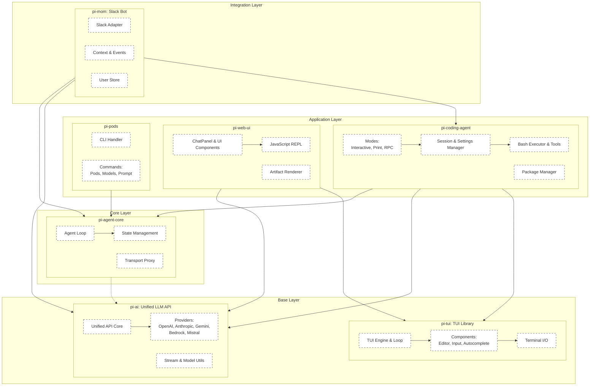

# Pi Mono Architecture

```mermaid
graph TD
    %% Styling
    classDef base fill:#e1f5fe,stroke:#01579b,stroke-width:2px;
    classDef core fill:#fff9c4,stroke:#fbc02d,stroke-width:2px;
    classDef app fill:#e8f5e9,stroke:#2e7d32,stroke-width:2px;
    classDef integration fill:#f3e5f5,stroke:#7b1fa2,stroke-width:2px;
    classDef component fill:#ffffff,stroke:#333,stroke-width:1px,stroke-dasharray: 5 5;

    subgraph Base_Layer [Base Layer]
        direction TB
        subgraph Ai [pi-ai: Unified LLM API]
            AiCore[Unified API Core]:::component
            AiProviders[Providers:<br/>OpenAI, Anthropic, Gemini,<br/>Bedrock, Mistral]:::component
            AiUtils[Stream & Model Utils]:::component
        end
        class Ai base

        subgraph Tui [pi-tui: TUI Library]
            TuiEngine[TUI Engine & Loop]:::component
            TuiTerminal[Terminal I/O]:::component
            TuiComponents[Components:<br/>Editor, Input, Autocomplete]:::component
        end
        class Tui base
    end

    subgraph Core_Layer [Core Layer]
        subgraph AgentCore [pi-agent-core]
            AgentLoop[Agent Loop]:::component
            AgentTransport[Transport Proxy]:::component
            AgentState[State Management]:::component
        end
        class AgentCore core
    end

    subgraph Application_Layer [Application Layer]
        direction TB
        subgraph CodingAgent [pi-coding-agent]
            CaSession[Session & Settings Manager]:::component
            CaExec[Bash Executor & Tools]:::component
            CaModes[Modes:<br/>Interactive, Print, RPC]:::component
            CaPkg[Package Manager]:::component
        end
        class CodingAgent app

        subgraph WebUi [pi-web-ui]
            WebComponents[ChatPanel & UI Components]:::component
            WebRepl[JavaScript REPL]:::component
            WebArtifacts[Artifact Renderer]:::component
        end
        class WebUi app

        subgraph Pods [pi-pods]
            PodsCli[CLI Handler]:::component
            PodsCmd[Commands:<br/>Pods, Models, Prompt]:::component
        end
        class Pods app
    end

    subgraph Integration_Layer [Integration Layer]
        subgraph Mom [pi-mom: Slack Bot]
            MomAdapter[Slack Adapter]:::component
            MomContext[Context & Events]:::component
            MomStore[User Store]:::component
        end
        class Mom integration
    end

    %% Internal Dependencies within Packages
    AiCore --> AiProviders
    TuiEngine --> TuiComponents
    TuiComponents --> TuiTerminal
    AgentLoop --> AgentState
    CaModes --> CaSession
    CaSession --> CaExec
    WebComponents --> WebRepl

    %% Cross-Package Dependencies
    AgentCore -.-> Ai

    CodingAgent --> AgentCore
    CodingAgent --> Ai
    CodingAgent --> Tui

    WebUi --> Ai
    WebUi --> Tui

    Pods --> AgentCore

    Mom --> AgentCore
    Mom --> Ai
    Mom --> CodingAgent
```
